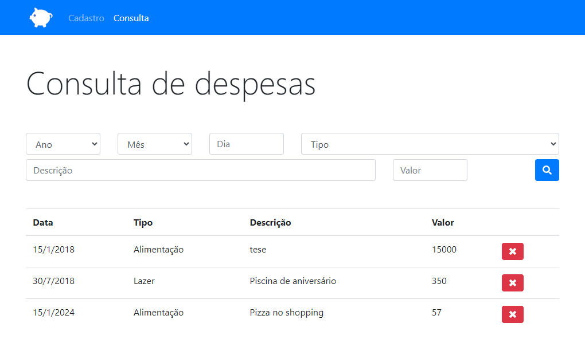

# PersonalBudget
Bem-vindo ao PersonalBudget, seu aplicativo completo para gerenciar suas finanças pessoais. App desenvolvido usando tecnologias web como HTML, CSS e JavaScript. 

## Visão Geral

O PersonalBudget é um aplicativo fácil de usar, projetado para ajudar indivíduos a gerenciar efetivamente suas finanças pessoais. Seja para economizar para um objetivo específico ou apenas para manter o controle dos gastos, o PersonalBudget tem tudo o que você precisa.

## Recursos

- Criação fácil e personalização de orçamento.
- Acompanhamento de despesas com categorização detalhada.
- Representação visual de seus padrões de gastos.
- Definição de metas para economias e marcos financeiros.

## Capturas de Tela

## Como Usar

1. Baixe o PersonalBudget em seu dispositivo.
2. Crie seu orçamento pessoal e defina metas financeiras.
3. Registre suas despesas diárias e monitore seu orçamento.

## Contribuições

1. Faça um fork do repositório.
2. Clone o fork para a sua máquina local.
3. Faça suas modificações e adições.
4. Envie um pull request para revisão.

## Estrutura do Projeto

- `index.html`: Página principal que representa a home do PersonalBudget.
- `js/`: Diretório contendo arquivos JS personalizados.
- `img/`: Diretório para armazenar imagens.

## Agradecimentos

Obrigado por contribuir com o PersonalBudget! Juntos, estamos construindo uma ferramenta poderosa para o gerenciamento das finanças pessoais. Sinta-se à vontade para relatar bugs, sugerir melhorias ou contribuir com código.

Feliz controle financeiro com o PersonalBudget!
